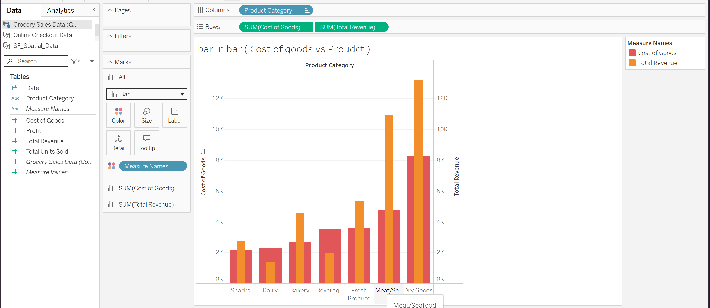
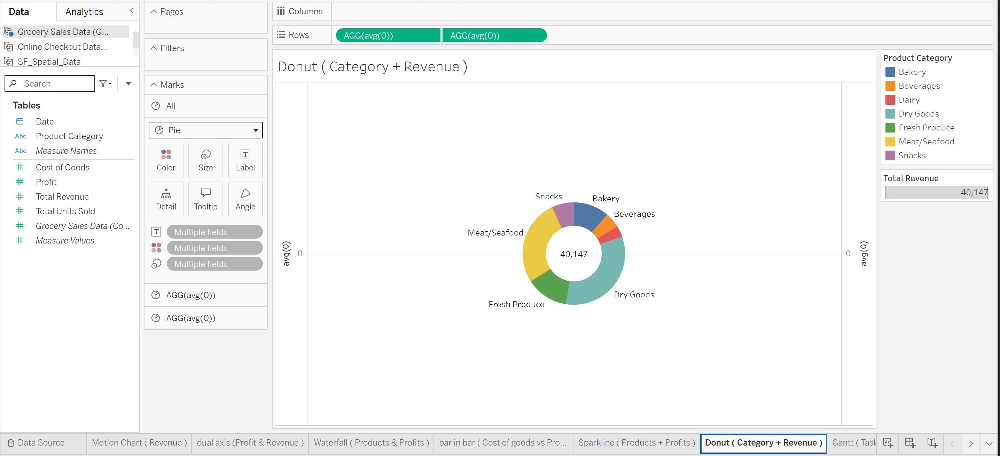
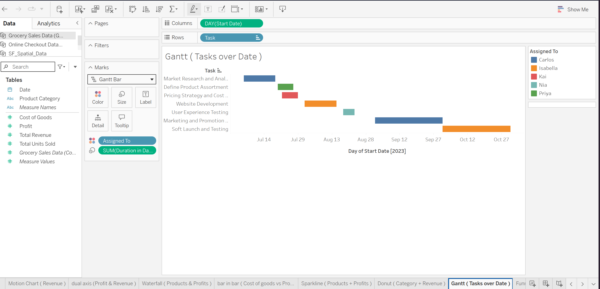
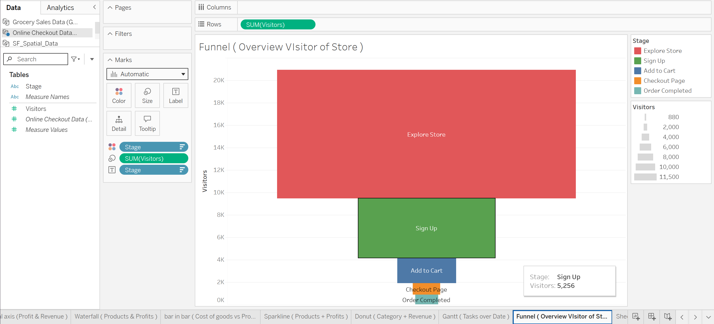
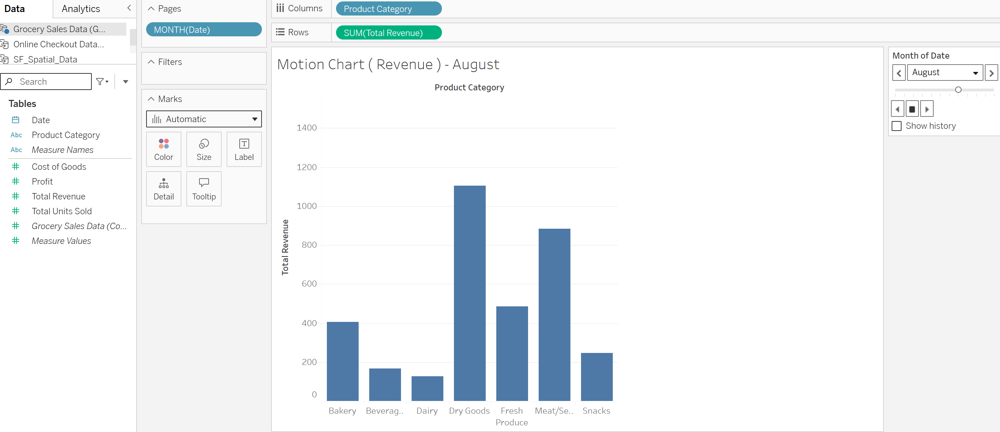

# Advanced Data Visualization with Grocery Sales Data (Tableau)

A multi-sheet Tableau workbook exploring grocery sales data — covering cost/revenue comparisons, category composition, task timelines, and revenue trends using five advanced visualization types.

## 🔗 Live Interactive Dashboard
[View on Tableau Public](https://public.tableau.com/app/profile/kaung.khant.han/viz/AdvanceDataVisualizationswithGroceryDataSales/barinbarCostofgoodsvsProudct) <!-- replace with your Tableau Public link -->

## 📊 Preview

## 🛠 Tools & Techniques Used
- Tableau Desktop / Tableau Public
- Multiple data connections: connected and managed data sources (`Grocery Sales Data`, `Online Checkout Data`, `SF_Spatial_Data`) within a single workbook, switching between sources per sheet as needed
- Bar-in-bar chart: side-by-side comparison of Cost of Goods vs. Total Revenue by product category
- Donut chart: revenue share breakdown by category
- Gantt chart: task/timeline tracking with resource assignment
- Funnel chart: conversion/drop-off analysis across stages
- Motion chart: animated revenue trend over time

## 📌 Sheet Breakdown
- **Bar in Bar (Cost of Goods vs. Product)** — Cost of Goods vs. Total Revenue compared across product categories
- **Donut (Category + Revenue)** — proportional revenue contribution by product category
- **Gantt (Tasks over Date)** — task durations and employee assignments across a project timeline
- **Funnel (Conversion)** — stage-by-stage conversion/drop-off view
- **Motion Chart (Revenue)** — revenue trends animated over time
- etc

## 🔧 Skills Demonstrated
- Managing and switching between multiple data source connections within one workbook
- Building diverse advanced chart types (bar-in-bar, donut, Gantt, funnel, motion) from related datasets
- Applying appropriate chart selection for different analytical goals: comparison, composition, timeline, conversion, and trend

## 📂 Dataset
Feel free to use the dataset in this repo for your own practice or projects.

